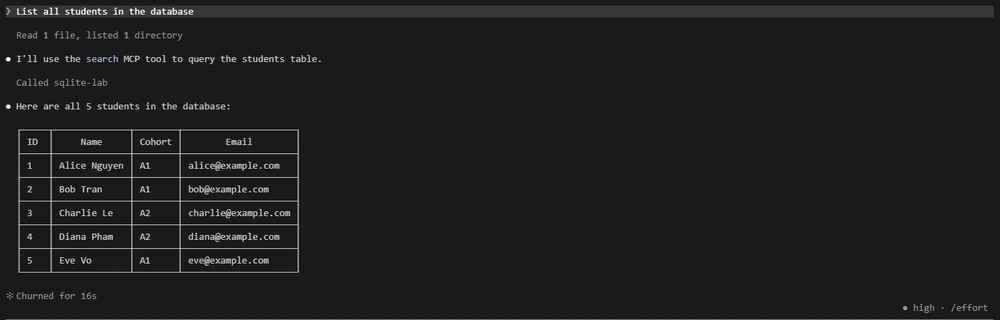

# SQLite MCP Server — Implementation

## Overview

A FastMCP server exposing a SQLite student/course database through MCP tools and resources.

**Student:** Lê Quang Miền (2A202600715)  
**Lab:** Day 26 — Track 3 — MCP Tool Integration  
**Stack:** Python 3.12+, FastMCP 3.4.2, SQLite3

---

## Project Structure

```
implementation/
├── db.py              # SQLiteAdapter — DB layer with validation
├── init_db.py         # Schema creation + seed data
├── mcp_server.py      # FastMCP server (3 tools, 2 resources)
├── verify_server.py   # Manual verification script
├── lab.db             # Generated SQLite database
└── .mcp.json          # Claude Code client config
```

## Setup

```bash
# 1. Install dependencies
pip install fastmcp

# 2. Initialize database
cd implementation
python init_db.py

# 3. Start server (stdio mode)
python mcp_server.py
```

## Tools

| Tool | Description | Example |
|------|------------|---------|
| `search` | Query rows with filters, column selection, ordering, pagination | `search(table="students", filters=[{"column":"cohort","operator":"=","value":"A1"}])` |
| `insert` | Insert a single row | `insert(table="students", values={"name":"Frank","cohort":"A2","email":"frank@example.com"})` |
| `aggregate` | Run COUNT/AVG/SUM/MIN/MAX with optional GROUP BY | `aggregate(table="enrollments", metric="avg", column="score", group_by="student_id")` |

## Resources

| URI | Description |
|-----|------------|
| `schema://database` | Full database schema (all tables) |
| `schema://table/{table_name}` | Schema for a single table |

## Validation & Error Handling

The server rejects:
- Unknown table names → `ValidationError`
- Unknown column names → `ValidationError`
- Unsupported filter operators (only `=`, `!=`, `>`, `<`, `>=`, `<=`, `LIKE`) → `ValidationError`
- Invalid aggregate metrics (only `count`, `avg`, `sum`, `min`, `max`) → `ValidationError`
- Empty insert values → `ValidationError`

All SQL uses parameterized queries — no raw string concatenation.

## Testing

### MCP Inspector

```bash
npx -y @modelcontextprotocol/inspector python mcp_server.py
```

### Verification Script

```bash
python verify_server.py
```

Expected output:
```
=== 1. List tables ===
['students', 'courses', 'enrollments']

=== 2. Search students cohort A1 ===
[3 rows: Alice Nguyen, Bob Tran, Eve Vo]

=== 3. Insert new student ===
{'id': 6, 'name': 'Frank Do', 'cohort': 'A2', 'email': 'frank@example.com'}

=== 4. Aggregate: avg score by student ===
[student_1: 8.85, student_2: 7.9, student_3: 8.9, student_4: 6.85, student_5: 9.3]

=== 5. Error: unknown table ===
Caught: Unknown table: nonexistent

=== 6. Error: bad operator ===
Caught: Unsupported operator 'DROP'

=== 7. Schema resource ===
  students: ['id', 'name', 'cohort', 'email']
  courses: ['id', 'title', 'credits']
  enrollments: ['id', 'student_id', 'course_id', 'score']
```

## Client Configuration

### Claude Code (`.mcp.json`)

```json
{
  "mcpServers": {
    "sqlite-lab": {
      "type": "stdio",
      "command": "python",
      "args": ["D:/VinUni-Day26/Day26-Track3-MCP-tool-integration/implementation/mcp_server.py"]
    }
  }
}
```

Verified: Claude Code connected successfully, `search` tool returned 5 students.


### Gemini CLI (alternative)

```bash
gemini mcp add sqlite-lab python /path/to/implementation/mcp_server.py --timeout 10000
```

## Data Model

- **students** (id, name, cohort, email) — 5 seed rows
- **courses** (id, title, credits) — 3 seed rows
- **enrollments** (id, student_id, course_id, score) — 10 seed rows